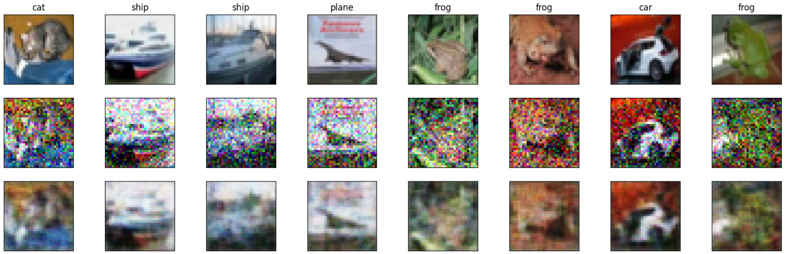

# DENOISING AUTOENCODER FOR CIFAR-10

Model reconstructions with 0.4 noise

Network Architecture:

    4 Convolutional Layers
    
    4 Fully Connected Layers
    
    Max Pooling Layers
    
    Dropout Layers
    
    Batch Normalization Layers

Weight Initialization:

    Kaiming Uniform Initialization

Optimization Algorithm:

    Stochastic Gradient Descent (SGD) with lr = 0.001

Training Parameters:

    Epochs: 250
    
    Batch Size: 128
